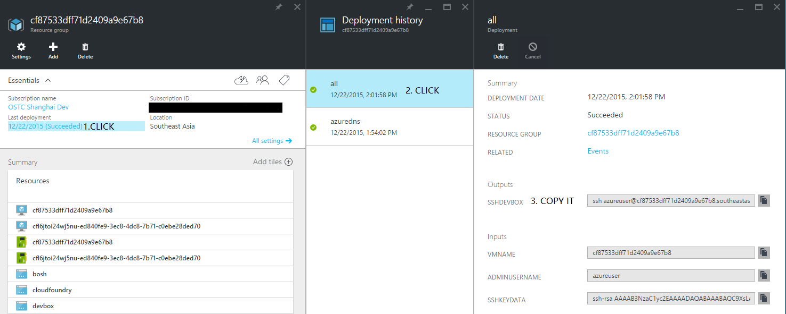

# Deploy BOSH on Azure via ARM templates

>**NOTE**: This guidance is for the version `v3.0.0+` of [bosh-setup template](https://github.com/Azure/azure-quickstart-templates/tree/master/bosh-setup). The `v3.0.0+` is based on [cf-deployment](https://github.com/cloudfoundry/cf-deployment). The older version `v2.7.0` of the template is based on [cf-release](https://github.com/cloudfoundry/cf-release). If you would like to follow the guidance for the older template, please go to the [doc](https://github.com/cloudfoundry/bosh-azure-cpi-release/tree/a5a3f6c3d0c773aa274fe96f2e5fee4ecf3d7b00/docs/get-started/via-arm-templates/deploy-bosh-via-arm-templates.md).

# 1 Prepare Azure Resources

Here we’ll create the following Azure resources that’s required for deploying BOSH and Cloud Foundry:

* A default Storage Account
* A Virtual Network and 3 Network Security Groups
* A Virtual Machine as your dev-box
* A Bosh director if you need
* A Load Balancer and a Public IP which will be the entrypoint of the Cloud Foundry deployment
* A Cloud Foundry deployment if you need

The [**bosh-setup**](https://github.com/Azure/azure-quickstart-templates/tree/master/bosh-setup) ARM template can help you to deploy all the above resources on Azure. Just click the button below with the following parameters:

<a href="https://portal.azure.com/#create/Microsoft.Template/uri/https%3A%2F%2Fraw.githubusercontent.com%2FAzure%2Fazure-quickstart-templates%2Fmaster%2Fbosh-setup%2Fazuredeploy.json" target="_blank">
    
</a>
<a href="https://portal.azure.us/#create/Microsoft.Template/uri/https%3A%2F%2Fraw.githubusercontent.com%2FAzure%2Fazure-quickstart-templates%2Fmaster%2Fbosh-setup%2Fazuredeploy.json" target="_blank">
    
</a>

| Name | Required | Default Value | Description |
|:----:|:--------:|:-------------:|:----------- |
| vmName | **YES** | | Name of Virtual Machine |
| ubuntuOSVersion | NO | 16.04.0-LTS | OS version of Ubuntu |
| adminUsername | **YES** | | Username for the Virtual Machines. **Never use root as the adminUsername**. |
| sshKeyData | **YES** | | SSH **RSA** public key file as a string. |
| \_artifactsLocation | NO | https://raw.githubusercontent.com/Azure/azure-quickstart-templates/master/bosh-setup/ | The base URI where artifacts required by this template are located. When the template is deployed using the accompanying scripts, a private location in the subscription will be used and this value will be automatically generated. |
| environment | **YES**  | | Different environments in Azure. Available values: `AzureCloud`, `AzureChinaCloud`, `AzureUSGovernment`, `AzureGermanCloud` and `AzureStack`. |
| servicePrincipalType | NO  | Password | Service principal supports two types: with a password or with a certificate. Available values: `Password` and `Certificate`. |
| tenantID | **YES**  | | ID of the tenant |
| clientID | **YES**  | | ID of the client |
| clientSecret | NO | "" | secret of the client |
| certificate | NO | "" | Base64-encoded Certificate of the service principal. You can run `cat <PATH_TO_YOUR_PEM_CERTIFICATE> \| base64 -w 0`, and input the result. Check how to [create a service principal with a certificate](https://docs.microsoft.com/en-us/cli/azure/create-an-azure-service-principal-azure-cli?toc=%2Fazure%2Fazure-resource-manager%2Ftoc.json&view=azure-cli-latest#create-a-service-principal-for-your-application). |
| azureStackDomain | NO | NotApplicableIfEnvironmentIsNotAzureStack | Azure Stack deployment domain. Please check the [doc](https://github.com/cloudfoundry/bosh-azure-cpi-release/tree/master/docs/advanced/azure-stack). |
| azureStackResource | NO | NotApplicableIfEnvironmentIsNotAzureStack | Azure Stack Active Directory Service Endpoint Resource ID. Please check the [doc](https://github.com/cloudfoundry/bosh-azure-cpi-release/tree/master/docs/advanced/azure-stack). |
| azureStackAuthentication | NO | AzureAD | Azure Stack Authentication. Available values: `AzureAD`, `AzureChinaAD` and `ADFS`. Please check the [doc](https://github.com/cloudfoundry/bosh-azure-cpi-release/tree/master/docs/advanced/azure-stack). |
| azureStackCARootCertificate | NO | "" | Azure Stack CA root certificate, which is base64 encoded. Get the Azure Stack CA root certificate from the Azure Stack operator, run `cat <PATH_TO_YOUR_PEM_CERTIFICATE> \| base64 -w 0`, and input the result. If not provided, `/var/lib/waagent/Certificates.pem` will be used. Please check the [doc](https://github.com/cloudfoundry/bosh-azure-cpi-release/tree/master/docs/advanced/azure-stack#azure-stack-properties). |
| loadBalancerSku | NO | standard | The sku of the load balancer to be used. Note: Standard Sku LB is not supported in Azure Stack and Azure China Cloud. |
| useAvailabilityZones | NO | disabled | The flag to enable availability zones in cloud config. |
| autoDeployBosh | NO | enabled | The flag allowing to deploy the Bosh director. |
| boshVmSize | NO | Standard_D2_v2 | The VM size of the BOSH director VM. Please check if the region support this VM size https://azure.microsoft.com/en-us/regions/#services. For more information about virtual machine sizes, see https://azure.microsoft.com/en-us/documentation/articles/virtual-machines-linux-sizes/ |
| boshLogLevel | NO | debug | The log level for Bosh. https://bosh.io/docs/cli-global-flags/#logging |
| autoDeployCloudFoundry | NO | disabled | The flag allowing to deploy Cloud Foundry automatically or not. |
| cloudFoundrySystemDomain | NO | NotConfigured | The Cloud Foundry system domain. If not specified, a xip.io domain will be used. |
| stemcellOSVersion | NO | Trusty | The OS version of stemcell when deploying Cloud Foundry |

**NOTE:**
  * Currently BOSH can be only deployed from a Virtual Machine (dev-box) in the same virtual network on Azure.

## 1.1 Basic Configuration

### 1.1.1 Generate your Public/Private Key Pair

The parameter `sshKeyData` should be a string which starts with `ssh-rsa`.

* For Linux/Mac Users

  Use ssh-keygen to create a 2048-bit RSA public and private key files, and unless you have a specific location or specific names for the files, accept the default location and name.

  ```
  ssh-keygen -t rsa -b 2048
  ```

  Then you can find your public key in `~/.ssh/id_rsa.pub`, and your private key in `~/.ssh/id_rsa`. Copy and paste the contents of `~/.ssh/id_rsa.pub` as `sshKeyData`.

  Reference: [How to Use SSH with Linux and Mac on Azure](https://azure.microsoft.com/en-us/documentation/articles/virtual-machines-linux-use-ssh-key/)

* For Windows Users

  1. Use `PuttyGen` to generate a public and private key pair.
  2. Use the public key as `sshKeyData`.
  3. Save the private key as a .ppk file.
  4. When you login the dev-box, use the .ppk file as the private key file for authentication.
  
  Optionally, you can follow the same steps for Linux users if you prefer to use the Windows Subsystem for Linux.

  Reference: [How to Use SSH with Windows on Azure](https://azure.microsoft.com/en-us/documentation/articles/virtual-machines-windows-use-ssh-key/)

### 1.1.2 Specify your Service Principal

The service principal includes `tenantID`, `clientID` and `clientSecret`. If you have an existing service principal, you can reuse it. If not, you should click [**HERE**](../create-service-principal.md) to learn how to create one.

### 1.1.3 Deploy Bosh Director Automatically

By default, `autoDeployBosh` is set to `enabled`. The Bosh director will be deployed automatically by the template. As a result, the deployment time of `bosh-setup` template will be much longer (~1h).

If `autoDeployBosh` is set to `disabled`, you can [login the dev-box](#2-login-your-dev-box) after the deployment succeeds, and run `./deploy_bosh.sh`. Additionally, you can check the ops file in [bosh-deployment](https://github.com/cloudfoundry/bosh-deployment) to customize your BOSH director.

### 1.1.3 Deploy Cloud Foundry Automatically

By default, `autoDeployCloudFoundry` is set to `enabled`. The Cloud Foundry will be deployed automatically after the BOSH director is deployed. Since the CF deployment takes a long time, so the template will run it background. It means, after the BOSH director is deployed, the status of the template deployment will become `Succeeded`. You need to login the dev-box, and check `~/install.log` whether the CF deployment is finished.

If `autoDeployCloudFoundry` is set to `disabled`, you can [login the dev-box](#2-login-your-dev-box) after the deployment succeeds, and run `./deploy_cloud_foundry.sh`. Additionally, you can check the ops file in [cf-deployment](https://github.com/cloudfoundry/cf-deployment) to customize your Cloud Foundry.

## 1.2 Advanced Configurations

If you want to customize your `bosh-setup` template, you can modify the following variables in [azuredeploy.json](https://portal.azure.com/#create/Microsoft.Template/uri/https%3A%2F%2Fraw.githubusercontent.com%2FAzure%2Fazure-quickstart-templates%2Fmaster%2Fbosh-setup%2Fazuredeploy.json).

| Name | Default Value |
|:----:|:-------------:|
| storageAccountType | Standard_LRS |
| virtualNetworkName | boshvnet-crp |
| virtualNetworkAddressSpace | 10.0.0.0/16 |
| subnetNameForBosh | Bosh |
| subnetAddressRangeForBosh | 10.0.0.0/24 |
| subnetNameForCloudFoundry | CloudFoundry |
| subnetAddressRangeForCloudFoundry | 10.0.16.0/20 |
| devboxNetworkSecurityGroup | nsg-devbox |
| boshNetworkSecurityGroup | nsg-bosh |
| cfNetworkSecurityGroup | nsg-cf |
| vmSize | Standard_D1_v2 |
| devboxPrivateIPAddress | 10.0.0.100 |
| keepUnreachableVMs | false |

**NOTE:**
  * The default type of Azue storage account is "Standard_LRS". For a list of available Azure storage accounts, their capacities and prices, check [**HERE**](http://azure.microsoft.com/en-us/pricing/details/storage/). Please note Standard_ZRS account cannot be changed to another account type later, and the other account types cannot be changed to Standard_ZRS. The same goes for Premium_LRS accounts.
  * `vmSize` is the instance type of the dev-box. For a list of available instance types, please check [**HERE**](https://azure.microsoft.com/en-us/documentation/articles/virtual-machines-size-specs/).
  * Set `keepUnreachableVMs` as true when you want to keep unreachable VMs when the deployment fails.

# 2 Login your dev-box

After the template deployment succeeded, you can find the resource group with the name you specified on Azure Portal. The VM in the resource group is your dev-box.

* For Linux/Mac Users

  You can find the output `SSHDEVBOX` in `Last deployment`. `SSHDEVBOX` is a string just like `ssh <adminUsername>@<vm-name-in-lower-case>.<location>.cloudapp.azure.com`.
  
  

  The private key is `~/.ssh/id_rsa` if you accept the default location and name when you generate the ssh key. If so, please run `ssh <adminUsername>@<vm-name-in-lower-case>.<location>.cloudapp.azure.com` to login your dev-box.

  If you specified the location and name of the private key, please run `ssh <adminUsername>@<vm-name-in-lower-case>.<location>.cloudapp.azure.com -i <path-to-your-private-key>`.

* For Windows Users

  1. Open **Putty**.
  1. Fill in `Public IP address/DNS name label` of the dev-box.
  1. Before selecting **Open**, click the `Connection > SSH > Auth` tab to choose your private key (.ppk).

After you login, you can check `~/install.log` to determine the status of the deployment. After the BOSH director is created, you can run `~/login_bosh.sh` to login the BOSH director. After Cloud Foundry is deployed, you can run `~/login_cloud_foundry.sh` to login Cloud Foundry.

# 3 Deploy BOSH

If you have enabled the parameter `autoDeployBosh`, you can skip this step.

## 3.1 Configure

The ARM template pre-creates and configure the deployment manifest file `bosh.yml` in your home directory. You do not need to update it unless you have other specific configurations.

## 3.2 Deploy

Run the following commands in your home directory to deploy bosh:

```
./deploy_bosh.sh
```

**NOTE:**
  * Never use root to perform these steps.
  * More verbose logs are written to `~/run.log`.
  * If you hit any issue, please see [**troubleshooting**](../../additional-information/troubleshooting.md), [**known issues**](../../additional-information/known-issues.md) and [**migration**](../../additional-information/migration.md). If it does not work, you can file an issue [**HERE**](https://github.com/cloudfoundry/bosh-azure-cpi-release/issues).

Export the following environment variables from `~/login_bosh.sh` into `~/.profile`.

```
export BOSH_ENVIRONMENT=10.0.0.4
export BOSH_CLIENT=admin
export BOSH_CLIENT_SECRET="\$(bosh int ~/bosh-deployment-vars.yml --path /admin_password)"
export BOSH_CA_CERT="\$(bosh int ~/bosh-deployment-vars.yml --path /director_ssl/ca)"
```
